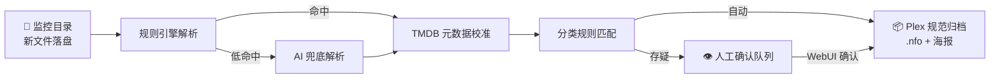

<div align="center">

# PersonalMediaManager

**本地优先的 Windows 媒体文件自动整理工具**

自动识别落盘的电影 / 剧集文件,调取 TMDB 元数据,按 Plex 规范重命名归档,
生成 `.nfo` 与海报,供 Plex / Emby / Jellyfin 直接消费。

[](https://github.com/mdjs147/PersonalMediaManager/releases/latest)
[](LICENSE)
[](#环境要求)
[](#技术栈)
[](#技术栈)

</div>

---

## 这是什么

下载器把 `[字幕组] 某某剧 - 07 [1080p][简繁内封].mkv` 这样的文件丢进下载目录后,媒体服务器往往认不出它是什么。PersonalMediaManager(PMM)常驻系统托盘监控这些目录,新文件落盘即自动完成 **解析 → 元数据校准 → 分类 → 规范化归档** 全流程,把杂乱的下载产物变成媒体服务器可直接刮削的标准库结构:

```
电影库/沙丘2 (2024) {tmdb-693134}/沙丘2 (2024) {tmdb-693134}.mkv
剧集库/某某剧 (2024) {tmdb-123456}/Season 01/某某剧 (2024) - S01E07.mkv
```

**单文件 exe,双击即用**——无容器、无云服务、无外部数据库,所有数据落本地 SQLite,通过浏览器 WebUI 管理,局域网内手机 / 平板均可访问。

## 功能特性

### 🔍 智能识别
- **规则引擎优先**:内置可视化管理的正则规则库,结合文件名与完整路径段提取标题、年份、季集号;支持自定义规则、优先级排序、样例实时测试
- **复杂命名兜容**:字幕组多括号标签、中文数字 / 罗马数字 / 篇章季名、合集目录等常见「脏」命名均可识别
- **AI 按需兜底**:规则命中度低时才调用 AI 解析,支持 **Ollama(本地)/ 通义千问 / DeepSeek / 任意 OpenAI 兼容 API**,主备双提供商自动切换;不配置 AI 也能正常使用
- **TMDB 校准**:解析结果经 TMDB 搜索校准,标题语言回退链(中文 → 原文 → 解析名),本地缓存减少重复请求

### 🗂️ 自动归档
- **媒体分类系统**:自定义分类(电影 / 电视剧 / 动漫…)与匹配规则,每个分类独立目标目录
- **Plex 规范命名**:`作品名 (年份) {tmdb-NNN}` 目录结构 + 季 / 集标准文件名,同一作品多文件自动归入同一目录
- **元数据落地**:自动生成 `.nfo` 与海报文件,字幕等伴随文件随主文件一起搬移
- **安全护栏**:移动 / 复制模式可选,同名冲突自动跳过,支持演练模式(dry-run)先预览归档落点

### 👁️ 人工兜底
- **待处理队列**:无法自动定论的任务进入人工确认队列,WebUI 修正后一键确认,支持批量操作
- **处理历史**:全部终态记录按日期 / 状态 / 解析来源(规则 / AI / 混合)筛选回看,失败可重试
- **媒体库海报墙**:已归档作品按 TMDB 聚合展示,作品详情页集中管理(重试 / 重新处理 / 删除 / 整剧操作)
- **字幕下载**:对已归档记录手动搜索 Assrt(伪·射手网)字幕并亲自挑选下载,按 Plex 规范命名落到视频旁,绝不自动触发、绝不覆盖已有字幕

### 🖥️ 易用运维
- **托盘常驻**:单实例守护、开机自启、Windows Toast 通知,所有交互在浏览器完成
- **现代 WebUI**:Vue 3 + Element Plus,响应式适配手机 / iPad;仪表盘统计、SignalR 实时日志流
- **事件 Webhook**:任务事件出站推送(带重试与出站审计),可对接自动化 / IM 通知链路
- **自动更新检查**:后台对比 GitHub Releases,新版本托盘气泡提醒
- **安全设计**:JWT 认证 + 角色控制;TMDB / AI 的 API Key 经 DataProtection 加密落库;日志敏感信息自动脱敏

## 工作原理



## 快速开始

### 环境要求

- Windows 10 / 11 x64(发布包自包含运行时,**无需安装 .NET**)
- 一个 [TMDB API Key](https://www.themoviedb.org/settings/api)(免费注册)

### 安装使用

1. 从 [Releases](https://github.com/mdjs147/PersonalMediaManager/releases/latest) 下载最新的 `PersonalMediaManager-x.y.z-win-x64.exe`,放到任意目录(**单文件,无需解压安装**)
2. 双击 exe,程序进入系统托盘
3. 托盘图标右键 →「打开 WebUI」(默认 `http://localhost:7288`)
4. 首次启动进入初始化向导,创建管理员账号
5. 在 **设置** 页配置 TMDB API Key、监控目录与媒体分类,即可开始自动整理

> **数据目录**:默认为 exe 旁的 `data\` 子目录(绿色软件,整目录拷走即迁移);若程序目录不可写(如装入 `Program Files`),自动回退 `%LocalAppData%\PersonalMediaManager\`。数据库、日志、密钥环、海报缓存均落此处。

### 常用配置

| 途径 | 适用 |
|---|---|
| WebUI 设置页 | 绝大多数运行配置:监控目录、分类规则、解析规则、TMDB / AI / Webhook、账户等(持久化到 SQLite) |
| 托盘菜单 | 扫描全部已启用监控目录、改 WebUI 端口、改数据库位置(写入 `data\local.json`) |
| 开关服务 / 开机自启 | 托盘菜单勾选 |

## 从源码构建

### 前置

- .NET 10 SDK
- Node.js ≥ 22
- Visual Studio 2026 或任何支持 .NET 10 的 IDE(可选)

### 构建与运行

```powershell
git clone https://github.com/mdjs147/PersonalMediaManager.git
cd PersonalMediaManager

# 构建解决方案(自动触发前端 vite build 并嵌入 Host)
dotnet build PersonalMediaManager.slnx -c Debug

# 启动(Debug 构建监听 47333,与正式实例的 7288 错开)
dotnet run --project src/PersonalMediaManager.Launcher --framework net10.0-windows
```

前端热更开发(可选,另开终端):

```powershell
cd src/PersonalMediaManager.Frontend
npm ci
npm run dev   # vite dev server 监听 5173,/api 代理到 47333
```

### 跑测试

```powershell
dotnet test PersonalMediaManager.slnx -c Debug
```

> 800+ 测试全部基于内存数据库与本地文件 IO,**不依赖任何外部服务**。

### 发布单文件

```powershell
dotnet publish src/PersonalMediaManager.Launcher -c Release -r win-x64 `
  --self-contained true /p:PublishSingleFile=true
```

前端产物与 `appsettings.json` 一并嵌入程序集,发布产物只有一个 exe。

## 技术栈

| 层 | 选型 |
|---|---|
| 运行时 | .NET 10 + SQLite + EF Core 10 |
| Web | ASP.NET Core Kestrel + Controllers + SignalR + Scalar OpenAPI |
| 前端 | Vue 3 + Vite + Element Plus + openapi-fetch(类型化 client) |
| Launcher | Windows Forms NotifyIcon(SDK 内置,零第三方 UI 框架) |
| 凭据加密 | Microsoft.AspNetCore.DataProtection |
| 日志 | Serilog(Console + File + SignalR 实时推送) |
| 调度 | Quartz(全量扫描 / Webhook 重试 / 日志保留) |

## 架构概览

7 个 `src/` + 6 个 `tests/` 项目,严格单向引用的分层架构:

```
src/
├─ PersonalMediaManager.Launcher              进程入口 + 托盘 + 单实例守护
├─ PersonalMediaManager.Host                  ASP.NET Core 装配 + Controllers + Hubs + Workers
├─ PersonalMediaManager.Application           应用服务 + 契约接口 + DTO
├─ PersonalMediaManager.Domain                领域聚合 + 实体 + 值对象(零外部依赖)
├─ PersonalMediaManager.Infrastructure.Persistence    EF Core / SQLite / 迁移 / 拦截器
├─ PersonalMediaManager.Infrastructure.External       TMDB / AI Providers / Webhook 出站 / 更新检查
├─ PersonalMediaManager.Infrastructure.Platform       FileSystemWatcher / Quartz / DataProtection
└─ PersonalMediaManager.Frontend              Vue 3 SPA(.esproj,构建产物嵌入 Host)
```

```
Launcher → Host → { Application, Infrastructure.* }
Infrastructure.Persistence → Application + Domain
Infrastructure.External    → Application
Infrastructure.Platform    → Application
Application → Domain
Domain → (无依赖)
```

更多设计细节见 [docs/](docs/) 目录:[需求文档](docs/需求文档_PersonalMediaManager.md) · [数据库设计](docs/数据库设计.md) · [API 规范](docs/API规范.md) · [开发计划](docs/开发计划.md)

## 贡献

欢迎通过 [Issues](https://github.com/mdjs147/PersonalMediaManager/issues) 反馈问题与建议。项目处于快速迭代期,提交 PR 前建议先开 Issue 讨论方向,避免与进行中的改动冲突。

## 许可

本项目基于 [MIT License](LICENSE) 开源。

## 致谢

- 元数据由 [TMDB](https://www.themoviedb.org/) 提供。本产品使用 TMDB API,但未经 TMDB 认可或认证。
- Plex、Emby、Jellyfin 为其各自所有者的商标,本项目与上述各方均无隶属关系。
